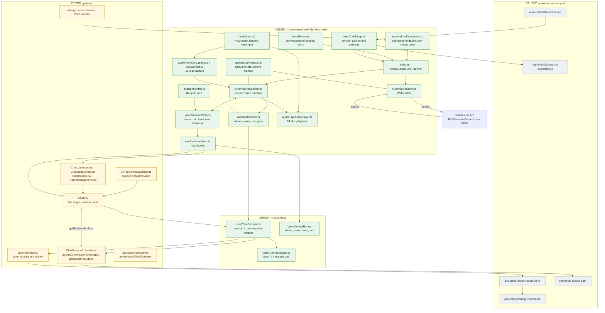

<h1 align="center">YOLO</h1>

  Agent-native AI assistant for Obsidian — chat, write, knowledge base, and orchestration, all in one place.

  This fork is adding gemini live api functionality 100% using AI. This will not reach upstream as unfortunately I break the rules like [“I asked the AI to fix it again” iteration loops with no human reasoning visible] and [Author can’t explain a non-trivial part of the diff during review] because i only have basic python knowledge. Hopefully it will not eternally like that as i keep learning :D 

  
  
  
  

  <b>English</b> | <a href="./README_zh-CN.md">简体中文</a> | <a href="./README_it.md">Italiano</a> | <a href="./README_es.md">Español</a>

  <a href="./documentation/en/README.md"><b>Documentation</b></a> | <a href="./documentation/en/getting-started.md">Getting started</a> | <a href="./documentation/en/faq.md">FAQ</a>

  

## What this fork adds: Gemini Live voice

The note above is the *why*. This is the *what* — the fork adds a third execution surface next to the
text agent and the CLI runtimes: pick a Gemini API-key provider in **Settings → Voice**, press the mic
in the composer, and talk. The model answers with audio, and the exchange lands in the conversation as
ordinary messages.

**Legend** — green: added by this fork · yellow: edited upstream · grey: upstream code, reused as is ·
uncoloured: Google's Live API and the network between it and the plugin.
Test files are not shown; they add another ~2,200 lines.

### Adds

| | Lines (non-test) |
| --- | --- |
| Added: `src/core/realtime/` — transport, protocol codec, turn state machine, audio capture/playback, session state, connection resolution, history seeding, tool bridge | 1,553 |
| Added: chat surface — session adapter, turn message builders, control bar, shared text→editor-state helper | 414 |
| Added: generic seams in upstream core (external stream 49, blocked-prefix helper 19, capability flag 12, gateway option 12, two exports 4) | 96 |
| Added: lines written into existing upstream files (the edits listed below) | 315 |
| Added: `settings.voice` schema, Voice settings section, i18n (25 keys × 3 locales), stylesheet | 479 |
| Added: docs | 18 |
| **Non-test total** | **2,875** |
| Tests (unit + integration, not shown above) | 2,198 |
| **Added vs upstream** | **5,073** (68 lines deleted) |

### Changes upstream

Small, generic seams rather than voice-specific branches:

- **`AgentSessionService`** gains an *external assistant stream*: a surface that is not an agent run can
  publish assistant text into the same render stream, so the assistant bubble needs no voice code.
- **`AgentToolGateway`** gains `advertisesAllToolSchemas`, for a surface that receives every schema up
  front instead of through the deferred-disclosure protocol.
- **`ChatRuntimeCapabilities`** gains `supportsRealtimeVoice` — the mic control and the picker locks read
  the capability table instead of comparing against the active runtime.
- **`ChatSessionController`** gains one generic write-back (`upsertConversationMessages`) and one
  `getRealtimeSurface` port; a typed message while a session runs routes to it exactly the way it
  already routes to a CLI runtime.
- **`Chat.tsx`** is the single place that turns "a session is live" into picker locks and those ports.
- `src/components/chat-view/RuntimeSelector.tsx` and `AssistantMessageContent.tsx` are **byte-identical
  to upstream** again; `CliChatSurface.tsx` lost a private helper the fork now shares.

### Rules it follows

- It never calls `AgentSessionService.run` — the Live model drives its own loop, tool calls included.
- **One streaming channel**: the spoken transcript uses the agent's render stream, not a second one.
- The same tool boundary as text: workspace scope, skill paths and the terminal command blocklist.
- Audio never reaches disk, and an uncommitted turn is not persisted.
- Desktop only; the mobile graph never loads the module.

## Sponsors

<table>
<tr>
<td width="200" align="center" valign="middle">
  
</td>
<td valign="middle">
  Thanks to <b><a href="https://go.apimart.ai/gh-obsidian-yolo">APIMart</a></b> for sponsoring this project! APIMart is a low-cost API platform for AI image &amp; video generation — GPT-Image-2 from $0.006/image, 160+ images per dollar. One async API covers both image and video: submit a task, get an ID, fetch results via polling or callback. Batch tens of thousands of images without timeouts, switch models without changing code. Pay-as-you-go with no monthly fee — sign up here to get started.
    
  <a href="https://go.apimart.ai/gh-obsidian-yolo"><b>Sign up for APIMart →</b></a>
</td>
</tr>
<tr>
<td width="200" align="center" valign="middle">
  
</td>
<td valign="middle">
  Thanks to <b><a href="https://fluxionai.space/register?source=github&amp;campaign=github-yolo&amp;promo=YOLO">Fluxion AI</a></b> for sponsoring this project! Fluxion AI is an API relay that helps individual developers and businesses access and manage the world's leading AI models through one unified API. Multi-route dynamic scheduling keeps requests available, and model performance, response times, and costs are all transparent. With Fable 5.1, Fluxion AI can save you up to about 90% compared with Claude's official API pricing. Sign up through this link to get $3 in free API credit.
    
  <a href="https://fluxionai.space/register?source=github&amp;campaign=github-yolo&amp;promo=YOLO"><b>Sign up for Fluxion AI →</b></a>
</td>
</tr>
</table>

## What's New

- **`1.6`**
  - **On-device local embedding models and multiple knowledge bases**: index without any API key, split and manage knowledge bases independently, and let the Agent auto-pick the right one by name.
  - **CLI chat**: on desktop, drive the Claude Code, Codex, Hermes, Pi, or Grok CLI you're already signed into from the same chat surface.
  - **The new Learning Mode**: turn any topic and reference material into a personalized learning project with structured outlines, knowledge points, flashcards, and an interactive knowledge map, backed by FSRS spaced repetition and Anki `.apkg` import for sustainable long-term review.

- **`1.5`**: Introduces a new Agent runtime that turns AI from Q&A into active collaboration—with full tool calling, MCP, Skills, desktop Bash, subagents, and web search—plus smarter long-session context and memory, refreshed hybrid RAG, focus/PDF awareness, and multi-window chat with background Agents.

## Highlights

<table>
<tr>
<td width="50%" align="center"><b>A Complete Agent Experience | Use Codex / Claude Code Inside Obsidian</b></td>
<td width="50%" align="center"><b>Turn Vault Knowledge into Lasting Mastery</b></td>
</tr>
<tr valign="top">
<td align="center"></td>
<td align="center"></td>
</tr>
<tr valign="top">
<td align="center">Go beyond answers. YOLO understands and works directly with your Vault, calls tools and MCP servers, and uses Skills to get real work done your way. On desktop, switch in one click to a supported CLI agent you are already signed in to and let it work directly in your Vault.</td>
<td align="center">Turn topics and source material into a personal learning system, then use flashcards and FSRS-powered review to move from saved notes to lasting knowledge.</td>
</tr>
<tr>
<td colspan="2" align="center"><b>YOLO Whiteboard | A High-Performance Obsidian Canvas</b></td>
</tr>
<tr>
<td colspan="2" align="center"></td>
</tr>
<tr>
<td colspan="2" align="center">For now, think of it as an Obsidian Canvas several to dozens of times faster. More features that push the boundaries of AI and human thinking are on the way.</td>
</tr>
</table>

## Features

Beyond the core capabilities above, YOLO also provides:

| Feature | Description |
|---------|-------------|
| 🖥️ CLI Agent (Desktop) | Reuse a supported locally signed-in CLI agent, including Claude Code, Codex, Hermes, Pi, and Grok, right inside Obsidian |
| 🔌 External Agent Support | Connect MCP clients such as Hermes and OpenClaw to YOLO's Vault search, or delegate tasks to a configured YOLO Agent |
| ⚡ Quick Ask | Ask, edit, and continue writing without leaving the editor |
| 🔎 Vault RAG | Retrieve across your Vault for answers grounded in your own notes |
| 🪟 Multi-Window Chat | Run different tasks and contexts in parallel across independent chat windows |
| 🧠 Memory System | Lets YOLO remember preferences, habits, and long-term context for more consistent conversations |
| 🪡 Cursor Chat | One-click context addition, conversation at your fingertips |
| ⌨️ Tab Completion | Real-time AI-powered completion for smoother, more natural writing |
| 🎛️ Multi-Model Support | OpenAI, Claude, Gemini, DeepSeek and other mainstream models, freely switch |
| 🌍 i18n | Native multi-language support |

## Quick Start

1. Open Obsidian Settings → Community Plugins → Browse → Search **"YOLO"**
2. Install and enable
3. Configure your API key in plugin settings, or use your own ChatGPT OAuth / Gemini OAuth:
   - [OpenAI](https://platform.openai.com/api-keys) / [Anthropic](https://console.anthropic.com/settings/keys) / [Gemini](https://aistudio.google.com/apikey) / [Groq](https://console.groq.com/keys)
4. Open the sidebar to start chatting — or try Quick Ask by typing `@` in the editor

## Installation

### Community Plugin Store (Recommended)

See Quick Start above.

### Manual Installation

1. Go to [Releases](https://github.com/Lapis0x0/obsidian-yolo/releases) and download the latest `main.js`, `manifest.json`, `styles.css`
2. Create folder: `<vault>/.obsidian/plugins/obsidian-yolo/`
3. Copy files to that folder, then enable the plugin in Obsidian Settings

> [!WARNING]
> YOLO cannot coexist with [Smart Composer](https://github.com/glowingjade/obsidian-smart-composer). Please disable or uninstall Smart Composer before using YOLO.

## Roadmap

- [x] Better and stronger Vault AI search
- [x] Background Agent (long-running task automation)
- [x] Multi-Agent orchestration (via subagents)
- [x] Learning Mode — a dedicated study view
- [ ] Annotation Mode — real-time AI annotations and suggestions on notes
- [ ] Built-in assistant — a corner-pinned helper for config/agents, with auto-compaction and scheduled tasks
- [ ] Better AI whiteboard
- [ ] Voice input & meeting notes

## Documentation

Full user documentation lives in **[documentation/en](./documentation/en/README.md)**:

| | |
|---|---|
| [Getting started](./documentation/en/getting-started.md) | Install, configure a working model, run your first chat |
| [Models & providers](./documentation/en/models.md) | Connect providers, OAuth sign-in, model parameters |
| [Chat](./documentation/en/chat.md) | Referencing notes, the three modes, tool approvals, applying edits |
| [Sparkle](./documentation/en/sparkle.md) | Quick Ask, Tab completion, selection rewrite |
| [Knowledge base](./documentation/en/knowledge-base.md) | Indexing, multiple knowledge bases, local embedding models |
| [Tools & permissions](./documentation/en/tools-and-permissions.md) | What it can touch, and how to rein it in |
| [Memory](./documentation/en/memory.md) · [Skills](./documentation/en/skills.md) · [Agents](./documentation/en/assistants.md) | Tailoring it to you |
| [MCP](./documentation/en/mcp.md) · [CLI agents](./documentation/en/cli-agent.md) · [Modules](./documentation/en/modules.md) | Going further |
| [Settings reference](./documentation/en/settings-reference.md) · [FAQ](./documentation/en/faq.md) | Look things up |

Also available in [简体中文](./documentation/zh-CN/README.md) and [Italiano](./documentation/it/README.md).

## Feedback & Issues

Hit a bug, something confusing, or have an idea? Open an issue:

🐛 [Report a bug](https://github.com/Lapis0x0/obsidian-yolo/issues/new?template=bug_report.yml) · ✨ [Request a feature](https://github.com/Lapis0x0/obsidian-yolo/issues/new?template=feature_request.yml)

What helps:

- Bug reports with a clear reproduction (Obsidian version, OS, plugin version, what you did, what happened)
- "I tried X and got Y" reports — UX papercuts, confusing wording, broken docs, outdated translations
- Concrete feature ideas tied to a real use case ("when I do A, I want B because C")

Please search existing issues first to avoid duplicates.

## Contributing

All forms of contribution are welcome — bug reports, documentation improvements, feature enhancements.

**Please open an issue first to discuss feasibility and implementation for major features.**

See [CONTRIBUTING.md](./CONTRIBUTING.md) for the full guide: what we welcome, AI-assisted PR policy, size guidelines, and dev setup.

## Acknowledgments

Thanks to [Smart Composer](https://github.com/glowingjade/obsidian-smart-composer) for the original work — without them, there would be no YOLO.

Special thanks to [Kilo Code](https://kilo.ai) for their sponsorship. Kilo is an open-source AI coding assistant platform with 500+ AI models, helping developers build and iterate faster.

  

## Support

If you find YOLO valuable, consider supporting the project:

  
  &nbsp;
  
  &nbsp;
  

Development logs are regularly updated on the [blog](https://www.lapis.cafe).

## License

[MIT License](LICENSE)

## Star History

